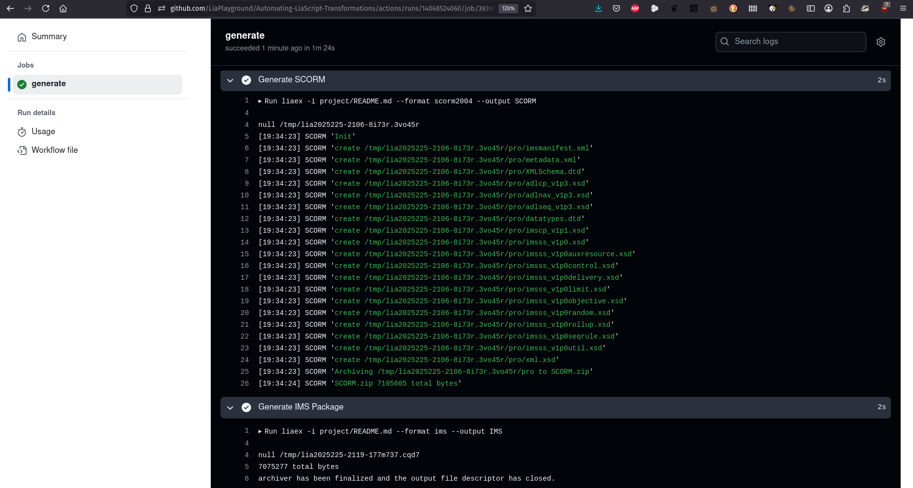

# Didaktische Handreichung:



<div>

Bildung für alle!
==============

## Open Educational Resources für die eigene Lehre finden, bearbeiten und teilen

```
Abbildung: https://selbstgesteuertes-lernen.de/
```
## Empfehlungen zur Durchführung eines Digital Workspaces

**Digitalisierung der Hochschulbildung in Sachsen (DHS)**

```
Diese Maßnahme wird mitfinanziert durch
Steuermittel auf der Grundlage des von den
Abgeordneten des Sächsischen Landtags
beschlossenen Haushalts.
```

Stand: 05. 12.

Digitalisierung der Hochschulbildung in Sachsen (DHS)

Projektzeitraum: 2019 – 2024

**Konzeptionelle Arbeit/Redaktion**

Dominic Dives, Universität Leipzig
Jana Riedel, Arbeitskreis E-Learning der Landesrektorenkonferenz Sachsen

**Kontakt**

Hochschuldidaktik Sachsen (HDS)
Geschäftsstelle
c/o Universität Leipzig
Marschnerstraße 31
04109 Leipzig

0341/97- 30080
programm@hd-sachsen.de

Titelgrafik von Projekt Weiterbildung selbstorganisiert. Lizenziert unter einer Creative Commons Namens-
nennung – Weitergabe unter gleichen Bedingungen 4.0 International Lizenz. Anpassung: Farbfilter.

Diese „Didaktische Handreichung: Bildung für alle! Open Educational Resources für die eigene Lehre finden,
bearbeiten und teilen“ steht unter einer CC BY SA 4.0-Lizenz. Der Urheber soll wie folgt genannt werden:
Dives, Dominic & Riedel, Jana für Digitalisierung der Hochschulbildung in Sachsen | Hochschuldidaktik Sach-
sen (HDS) (2023)

</div>

## II

### Steckbrief

_Alle im Steckbrief enthaltenen Informationen sind sowohl für Teilnehmende als auch für Trainer:innen rele-
vant. Kurzbeschreibung und Lernziele sind deshalb für die direkte Teilnehmendenansprache formuliert, sodass
sie für die Bewerbung des Digital Workspace unverändert übernommen werden können._

### Kurzbeschreibung

Open Educational Resources - Offene Bildungsressourcen - sind frei zugängliche Materialien, die
bearbeitet, wiederverwendet und geteilt werden dürfen. Damit sollen Bildungsmaterialien besser
zugänglich gemacht und ein Austausch unter Lehrenden ermöglicht werden. Verbunden mit dem
Wunsch nach Zeitersparnis und einfacher Materialverwaltung suchen Lehrende nach geeigneten
Materialien für ihre Veranstaltungen. Aber wo findet man diese und was muss dabei beachtet wer-
den? Darüber hinaus können Lehrende auch selbst OER-Materialien erstellen und veröffentlichen,
weil sie damit einen freien Zugang für viele Personen ermöglichen und zu einer Verbesserung der
Chancengleichheit im Bildungsbereich beitragen. Welche Tools können sie zur Bearbeitung von
OER-Materialien verwenden und was muss bei der Veröffentlichung eigener OER-Materialien be-
achtet werden? Der Digital Workspace widmet sich an zwei Tagen diesen beiden Perspektiven und
begleitet die Teilnehmenden, bei der Entwicklung eigener Recherche- und Veröffentlichung von
OER.

### Lernziele

Nach Abschluss des Workshops können die Teilnehmer*innen ...

- urheberrechtliche Herausforderungen in der (digitalen) Lehre erklären
- begründen, welchen Nutzen OER haben
- CC-Lizenzen erklären und deuten
- für sich relevante OER auf einschlägigen Portalen finden
- fremde OER mit verschiedenen Tools verändern/remixen
- (neu) erstellte OER unter der passenden Lizenz zur Verfügung stellen

### Zuordnung zu Handlungsfeldern^1

Die Veranstaltung wurde durch die Geschäftsstelle der Hochschuldidaktik Sachsen (HDS) den Hand-
lungsfeldern Methoden, Medien & Digitales (7AE) und Lehr-/Lernplanung & Curriculumsentwick-
lung (3AE) zugeordnet.

(^1) Die Einordnung orientiert sich an der in der Zertifikatsordnung der Hochschuldidaktik Sachsen (HDS) vorgegebenen
Handlungsfelder. Weitere Informationen finden Sie hier.


## III

### Zielgruppe

Statusgruppen

Der Digital Workspace eignet sich für alle Hochschullehrenden (ohne weitere Einschränkungen).

Fächergruppen

Es handelt sich um ein fächerübergreifendes Angebot.

Level und notwendiges Vorwissen der Teilnehmenden

Der Digital Workspace eignet sich primär für Anfänger:innen. Die Teilnehmenden benötigen keine
besonderen Vorkenntnisse.

### Empfohlene Teilnehmendenzahl

Der Digital Workspace eignet sich für eine Gruppengröße von 5 bis zu 20 Teilnehmenden.

### Format

Der Digital Workspace wurde als Online-Veranstaltung konzeptioniert.

### Umfang und Ablauf des Workspace (AE)

Der zweitägige Digital Workspace hat einen Gesamtumfang von 10 AE^2 , die vollständig synchron
konzipiert sind.

Tag 1 (5 AE):

- Vorwissensanalyse / Austausch über Vorwissen
- Recherchestrategien für OER
- Suchen (und Speichern) von OER auf verschiedenen Plattformen für eigene Projekte
- Individuelle Beratung

Tag 2 (5 AE):

- urheberrechtliche Herausforderungen in der (digitalen) Lehre: Creative Commons
- Bearbeitung gefundener OER-Materialien mittels frei zugänglicher Werkzeuge
- Erstellung, Lizensierung und Teilen eigener OER-Materialien
- Kultur des Teilens: Bedeutung von OER

### Barrierefreiheit

Keine Einschränkungen bezüglich des Themas

Methodischer Schwerpunkt: Ausprobieren, Erfahrungsaustausch

Verwendete technische Infrastruktur: Internet über Endgerät (empfohlen: Computer)

- Lernmanagementsystem: OPAL (Steckbrief, Wiki)
- Videokonferenzsystem: BigBlueButton (Break-Out-Sessions, geteilte Notizen, Whiteboard)

Weitere Informationen zur Barrierefreiheit befinden sich ausführlich im Access Statement.

(^2) Arbeitseinheiten (1 AE = 45 min).


##### IV

## Inhaltsübersicht

Einleitung **Vorbereitung ZIM-Plan** (^) möglichkeitenErweiterungs-
Voraussetzungen Ziele
Relevanz Inhalte
Access-Statement
Methoden
Materialien


## V

## Inhaltsverzeichnis

Steckbrief ............................................................................................................................................. II

Inhaltsübersicht ................................................................................................................................. IV

Inhaltsverzeichnis ................................................................................................................................ V

Begleitmaterialien ............................................................................................................................. VII

Abbildungsverzeichnis ..................................................................................................................... VIII


##### VI

- 1. Einleitung Tabellenverzeichnis VIII
- 2. Organisatorische Hinweise
   - 2.1 Benötigte Materialien & Tools
      - 2.1.1 LMS-Kurs
      - 2.1.2 Meetingraum Videokonferenztool einrichten
   - 2.2 Ergänzende Empfehlungen für Trainer:innen
      - 2.2.1 Anzahl der Trainer:innen
      - 3.2.2 Notwendiges Vorwissen und Kenntnisse der Trainer:innen
- 3. Überblick über den Digital Workspace
   - 3.1 Generelle Relevanz des Themas
   - 3.2 Detaillierter Ablaufplan (ZIM)
      - 3.2.1 Vorbereitung des Digital Workspace
      - 3.2.2 Durchführung des Digital Workspace
- 4. Thematische Schwerpunkte
- 5. Methoden & Aufgaben
   - 5. 1 Kennenlernen
      - 5.1.1 Definitionssammlung
      - 5.1.2 Standogramm
      - 5.1.3 Emoji-Quiz
   - 5.2 Arbeitsphase
      - 5.2.1 Web-Rallye
      - 5.2.2 Steckbrief schreiben
   - 5.3 Erstellung eines Praxiskonzepts durch die Teilnehmenden
   - 5.4 Evaluation & Feedback
      - 5.4.1 Zielscheibenfeedback
      - 5.4.2 Blitzlicht
- 6. Ideen für Optimierungs- und Erweiterungsmöglichkeiten
- 7. Access Statement
   - Resources für die eigene Lehre finden, bearbeiten und teilen“ 7.1 Erklärung zur Barrierefreiheit im Digital Workspace „Bildung für alle! Open Educational
   - 7.2 Hinweise zur Geschlechtersensibilität
   - 7.3 Hinweise zur Durchführungsform
   - 7.4 Hinweise zu möglichen Einschränkungen in der Teilnahme aufgrund des Themas
   - 7.5 Hinweise zum Methodeneinsatz
   - 7.6 Hinweise zur Aufbereitung der Materialien
   - 7.7 Hinweise zur genutzten Infrastruktur
      - 7.7.1 Lernmanagementsystem OPAL (Stand: 07.11.2023)
      - 7.7.2 Videokonferenzsystem Big Blue Button (Stand: 07.11.2023)
- Anhang
   - Anhang 1: Willkommens-E-Mail mit Vorbereitungsaufgabe
   - Anhang 2: Lösungen zu Quizfragen
   - Anhang 3: Vorlage zur Beantwortung der Arbeitsauftrage in der Web-Rallye
   - Anhang 4: Lösungen zur Web-Rallye
   - Anhang 5: Lösungen zum Emoji-Quiz
   - Anhang 6: Linkliste OER-Tools........................................................................................................


##### VII

## Begleitmaterialien

```
▪ Allgemeine Checkliste zur Durchführung des Digital Workspace
▪ PowerPoint-Präsentationen
o Rahmenpräsentation Tag 1
o Rahmenpräsentation Tag 2
o Web-Rallye
o Impuls „Urheberrecht und OER“ von Prof. Dr. Anne Lauber-Rhönsberg
o Vorbereitungsvideo inkl. Folien: „OER – Was bringt mir das? Und muss ich da mit-
machen?“ von Jana Riedel
```

##### VIII

## Abbildungsverzeichnis

Abbildung 1: Kursstruktur und -bausteine im LMS Kurs ...................................................................... 2

## Tabellenverzeichnis

Tabelle 1: Ablaufplan zur Vorbereitung des Digital Workspace .......................................................... 5
Tabelle 2: Ablaufplan der synchronen Veranstaltung an Tag 1 ..... **Fehler! Textmarke nicht definiert.**
Tabelle 3: Ablaufplan zur synchronen Veranstaltung an Tag 2 ..... **Fehler! Textmarke nicht definiert.**


##### 1

## 1. Einleitung

Liebe Leserin, lieber Leser, liebe Kollegin, lieber Kollege,

wir freuen uns, dass Sie auf unsere Weiterbildungsmaterialien aufmerksam geworden sind und un-
ser thematisches Interesse teilen. Die vorliegenden Materialien, sowie diese begleitende Handrei-
chung können Ihnen Hilfestellungen und Anstöße bei der Ausgestaltung Ihrer hochschuldidakti-
schen Qualifizierungsangebote sein. Alle Konzepte wurden im Rahmen des Verbundprojekts „Digi-
talisierung der Hochschulbildung in Sachsen“ (DHS) erstellt.

Das DHS-Verbundprojekt wurde durch eine Kooperation der Hochschuldidaktik Sachsen (HDS) und
des Arbeitskreises E-Learning der Landesrektorenkonferenz Sachsen (AKEL) initiiert. Die Förderung
erfolgte durch das Sächsische Staatsministerium für Wissenschaft, Kultur und Tourismus (SMWK).
Das Projekt wurde unter der Leitung der HDS und des AKEL gemeinsam mit den staatlichen sächsi-
schen Universitäten und Hochschulen für Angewandte Wissenschaften durchgeführt.

Im Zeitraum von 2019 bis 202 4 wurde in der Programmlinie „Digital Workspaces“ eine Vielzahl von
digitalen Weiterbildungsangeboten im Werkstattformat organisiert und durchgeführt. Die Digital
Workspaces boten Lehrenden der sächsischen Hochschullandschaft die Möglichkeit, thematisch fo-
kussiert an individuellen digital gestützten Lehr-Lernprojekten zu arbeiten, sich didaktisch beraten
zu lassen und Erfahrungen aus der eigenen Lehrpraxis auszutauschen. Zentrales Anliegen der Ver-
bundpartner:innen war es, Formate zu schaffen, die neben kurzen Wissensinputs, Lehrpersonen vor
allem Raum für die praktische Arbeit an eigenen Konzepten und maximale zeitliche sowie inhaltliche
Flexibilität boten. Somit oblag es den Teilnehmenden, welche inhaltlichen Schwerpunkte sie wähl-
ten und in welchem Umfang sie sich an Workspaces beteiligten. Dementsprechend war je nach Teil-
nahmezeit sowohl eine teilweise als auch eine vollständige Anrechnung auf das sächsische Hoch-
schuldidaktik-Zertifikat möglich.

Mit der Veröffentlichung unserer Digital-Workspace-Konzepte möchten wir einen Teil unserer Ar-
beitsergebnisse auch über das Projektende hinaus nutzbar machen, andere Hochschuldidaktiker:in-
nen und Interessierte teilhaben lassen, unsere Projektergebnisse nachhaltig sichern und damit auch
einen Beitrag zu einer offenen Bildungswelt leisten.

Alle veröffentlichten Konzepte stehen unter einer CC BY-SA 4.0 Lizenz. Sie können daher alle Mate-
rialien weiterverwenden, teilen und bearbeiten, sofern eine Veröffentlichung unter derselben Li-
zenz erfolgt. Sie entscheiden, ob Sie das Konzept in seiner Gesamtheit oder nur Ausschnitte (z. B.
Folien, Handreichungen, ...) daraus übernehmen möchten. Alternativ können Sie sich von unseren
Materialien auch nur für Ihre eigene Arbeit inspirieren lassen. Ein Steckbrief zum Digital Workspace
enthält Eckdaten zur Veranstaltung, die sich an Teilnehmende und Trainer:innen richten. Anschlie-
ßend finden Sie organisatorische Hinweise gefolgt von vertiefenden inhaltlichen Informationen, die
sich nur an die Trainer:innen richten. Ausgehend von einer Übersicht in Form einer ZIM-Tabelle ge-
langen Sie über Links zu Detailinformationen der einzelnen Lernphasen.

Wir wünschen Ihnen viel Erfolg und Freude bei der Verwirklichung Ihrer Weiterbildungsvorhaben.

_Dominic Dives und Jana Riedel für die Mitarbeiterinnen und Mitarbeiter des Projekts „Digitalisierung
der Hochschulbildung in Sachsen“_


##### 2

## 2. Organisatorische Hinweise

```
Alle folgenden Informationen dienen der ausführlichen Erläuterung von Ablauf, Inhalt und Methoden des Di-
gital Workspace. Sie richten sich deshalb ausschließlich an die Trainer:innen und sind nicht zur Weitergabe an
Teilnehmende gedacht.
```
### 2.1 Benötigte Materialien & Tools

```
Folgende Materialien werden für die Durchführung benötigt:
▪ Referent:in für einen Impulsvortrag zum Thema „Urheberrecht und OER“
▪ Videokonferenzsystem mit BreakOut-Räumen
▪ Kurs in einem Lernmanagementsystem (LMS) mit folgenden Funktionen:
o Wiki (für das Sammeln und Beantworten von Rechtsfragen)
o Steckbriefe (für die persönliche Vorstellung und Bezugnahme zum Thema OER, ggf.
auch als Forum)
o Kontakt-Möglichkeit für das Einsenden der Lösungen aus der Web-Rallye (z.B. E-
Mail, Chat, Forum, ...)
o Linkliste (zur Verlinkung von nützlichen Tools zur Medienerstellung)
▪ PowerPoint-Präsentation
▪ Einführungsvideo „OER kompakt - Was sind Open Educational Resources?“
▪ Ggf. Vertiefungsvideo „Digitale Lehre und Urheberrecht: §60a UrhG, Zitate, OER & Co.
(Was darf ich im Rahmen meiner Lehre nutzen?)“
```
#### 2.1.1 LMS-Kurs

```
Der Kurs dient der Einschreibung der Teilnehmenden und der Bereitstellung der im Digital Work-
space verwendeten Materialien und erarbeiteten Ergebnisse. Zusätzlich können Vorbereitungs- und
Übungsaufgaben bereitgestellt werden. Hierzu zählen ein Vorbereitungsvideo, eine Aufgabe zur
Vorstellung der eigenen OER-Vorhaben, eine OER-Rallye, eine Linkliste mit Tools zum Ausprobieren
sowie ein Wiki, in dem Fragen und Antworten an eine:n Rechtsexpert:in gesammelt und dokumen-
tiert werden.
Die Angebote wurden wie folgt strukturiert:
```
```
Abbildung 1 : Kursstruktur und -bausteine im LMS Kurs
```

##### 3

#### 2.1.2 Meetingraum Videokonferenztool einrichten

```
Das Videokonferenzsystem sollte über folgende Funktionen verfügen:
▪ Möglichkeit zum Zeichnen/Schreiben der Teilnehmenden auf vorbereiteten Folien (Mehr-
benutzermodus) oder einem Whiteboard
▪ Geteilte Notizen (oder anderes kollaboratives Textwerkzeug) zum Sammeln von Fragen
▪ Teilnehmende sollen selbst erstelle Produkte vorstellen können: hierfür müssen Präsentati-
onsrechte an Teilnehmende vergeben werden können, diese sollen den Bildschirm inkl.
Ton teilen können (zum Beispiel zur Präsentation eines selbst erstellten Videos)
```
### 2.2 Ergänzende Empfehlungen für Trainer:innen

#### 2.2.1 Anzahl der Trainer:innen

```
Empfohlen wird eine Durchführung des Digital Workspace durch 1 - 2 Personen.
Neben einer Hauptmoderation ist die Übernahme folgender Aufgaben durch eine Co-Moderation
ratsam:
▪ Fragen/Probleme im Chat beobachten und ggf. klären
▪ Rücklauf zur OER-Rallye empfangen und registrieren
▪ Antworten der Rechtsexpertin zu Fragen im Wiki protokollieren
▪ Individuelle Beratung in Phase der Produkterstellung anbieten
```
#### 3.2.2 Notwendiges Vorwissen und Kenntnisse der Trainer:innen

```
Allgemeine Kenntnisse und Kompetenzen
▪ souveräner Umgang mit dem gewählten Videokonferenzsystem
▪ Moderation von (Online-)Veranstaltungen
▪ Beratungskompetenz
▪ Mediendidaktik
Themenspezifische Kenntnisse und Kompetenzen
▪ Kenntnis von OER-Repositorien
▪ Kenntnis der empfohlenen Tools zur Erstellung eigener OER-Materialien
▪ Ggf. Erfahrung mit eigenen als OER veröffentlichten Materialien
```

##### 4

## 3. Überblick über den Digital Workspace

### 3.1 Generelle Relevanz des Themas

Die Nutzung von Open Educational Resources (OER) für die Hochschullehre wird im Zusammenhang
mit der digital gestützten Lehre als Chance angesehen. Einerseits bieten OER die Möglichkeit, Ma-
terialien anderer Autor:innen ohne zusätzliche Genehmigung und Nutzungserlaubnis in der eigenen
Lehre einzusetzen. Lehrende müssen so nicht alle Materialien aufwendig selbst erstellen, sondern
können auf bereits vorhandene Ressourcen zurückgreifen, ohne dabei das Urheberrecht zu verlet-
zen. Hochschullehrende sollten daher Strategien kennen, wo und wie sie nach OER-Materialien su-
chen können und unter welchen (einfachen) Bedingungen sie diese nutzen dürfen.

Andererseits bietet die Veröffentlichung eigener Materialien als OER vielfältige Möglichkeiten für
Hochschullehrende. Zusätzlich zur eigenen Sichtbarkeit und Reputation können sie wertvolles Feed-
back aus der Community erhalten, aus dem ggf. auch Lehrkooperationen und langfristiger Aus-
tausch nach dem Prinzip des Gebens und Nehmens entstehen kann.

Auch für die Betreuung von Projekten und Aufgaben, bei denen Studierende selbst (Lern-)Materia-
lien erstellen sollen, ist die Verwendung von OER hilfreich. Einerseits können Studierende das Ma-
terialnutzen und erweitert oder optimieren. Andererseits können die studentischen Produkte selbst
als OER lizenziert werden, damit sie in folgenden Lehrveranstaltungen weiter genutzt und einge-
bunden werden können.

Um die Chancen, der Nutzung und Bereitstellung von OER kennenzulernen, müssen Hochschulleh-
rende für das Thema sensibilisiert werden und die Gelegenheit erhalten, erste eigene Erfahrungen
zu machen. Insbesondere (urheber-)rechtliche Unsicherheiten sollten abgebaut werden, damit die
Hochschullehrenden freier und offener bei der Verwendung und Erstellung von Lernmaterialien
sind. Insofern ist OER nicht nur als Mittel zur Nutzung und Erstellung von ansprechenden Lernma-
terialien zu verstehen, sondern auch als Haltung für ein Miteinander in der Lehre.


##### 5

### 3.2 Detaillierter Ablaufplan (ZIM)

#### 3.2.1 Vorbereitung des Digital Workspace

##### ZEITPUNKT AUFGABE MATERIAL

```
Ca. 1 Woche vor Veran-
staltung
```
Versand vorbereitender Informationen, inkl. Vorbereitungsaufgabe (^) • Aufgabenstellung

- Video im LMS

**30 min vor Beginn** (^) • Konferenzraum öffnen

- Agenda in geteilte Notizen/Chat schreiben
- Technik-Check
_Tabelle 1 : Ablaufplan zur Vorbereitung des Digital Workspace_

#### 3.2.2 Durchführung des Digital Workspace

```
3.2.2.1 Termin 1
DAUER ZIEL & ZWECK INHALT METHODEN MATERIAL & TOOLS ERGÄNZENDE HIN-
WEISE
30 min Einstieg & An-
kommen
```
```
▪ Vorstellung der Lernziele und des Ta-
gesablaufs
▪ Begriffsverständnis OER
▪ Vorerfahrungen der Teilnehmenden
```
```
▪ Vortrag (mit Vi-
deo)
▪ Definitions-
sammlung
▪ Standogramm
```
```
▪ Präsentationsfo-
lien 1- 9
▪ Mehrbenutzer-
modus/ White-
board
▪ Video OER Kom-
pakt (YouTube)
```

##### 6

##### DAUER ZIEL & ZWECK INHALT METHODEN MATERIAL & TOOLS ERGÄNZENDE HIN-

##### WEISE

```
30 min Aktivierung
OER-Vorwis-
sen
```
```
▪ Beantwortung vorbereiteter Wissens-
fragen zu:
o OER-Recherche
o CC-Lizensierung: Verwendung Mate-
rialien
o CC-Lizensierung: Verwendung Bilder
```
```
▪ Multiple-Choice-
Quiz
```
```
▪ Präsentationsfo-
lien 11 - 15
```
```
Die Lösungen zu den
Quizfragen befinden
sich im Anhang.
```
```
60min Recherche-
strategien für
OER erleben
```
```
▪ Die Teilnehmenden erhalten Suchauf-
träge, um auf verschiedenen Plattfor-
men Angaben zu Urheber:innen und
Nutzungsrechten zu finden. Die Beant-
wortung der Fragen ist als Wettbewerb
gestaltet. Es gewinnt, wer zuerst alle
Antworten korrekt eingesendet hat.
```
```
▪ Web-Rallye ▪ Präsentationsfo-
lie 1 7
▪ Präsentation
„OER-Webral-
lye“ im LMS-
Kurs
▪ Vorgabe, wohin
die Antworten
auf die Recher-
cheaufträge ge-
sendet werden
soll
```
```
Die Rechercheauf-
träge waren als Prä-
sentation auch noch
einmal im LMS-Kurs
eingebunden, damit
ein individueller Be-
arbeitungsfortschritt
möglich war.
Die Lösungen zu den
Aufgaben finden sich
im Anhang.
60 min PAUSE
```
```
45 min Fragen an das
Thema OER
sammeln
```
```
▪ Sammlung und Beantwortung von Fra-
gen der Teilnehmenden
▪ Fragen mit einem rechtlichen Hinter-
grund werden für den Gastvortrag an
Tag 2 gebündelt und im Wiki dokumen-
tiert.
```
```
▪ Präsentationsfo-
lie 2 0
▪ Geteilte Notizen
zum Sammeln
der Fragen
```
```
Rechtliche Fragen im
Wiki sammeln.
```

##### 7

##### DAUER ZIEL & ZWECK INHALT METHODEN MATERIAL & TOOLS ERGÄNZENDE HIN-

##### WEISE

```
45 min Individuelle
Recherche-
und Bera-
tungsmöglich-
keit
```
```
▪ Hinweise zum Vorgehen bei der Re-
cherche
▪ Bearbeitung des Arbeitsauftrags: Fin-
den Sie geeignete OER-Materialien für
Ihre Lehrveranstaltung. Beantworten
Sie hierfür die Leitfragen in Ihrem
OPAL-Steckbrief.
```
```
▪ Steckbrief schrei-
ben
```
```
▪ Präsentationsfo-
lien 22- 26
▪ Vorbereiteter
Steckbrief mit
Leitfragen
```
```
30 min Abschluss und
Ausblick auf
Tag 2
```
```
▪ Ablauf Tag 2
▪ Feedback
```
```
▪ Zielscheiben-
feedback
```
```
▪ Präsentationsfo-
lien 2 7 - 30
```
_Tabelle 2 : Ablaufplan der synchronen Veranstaltung an Tag 1_

_3.2.2.2 Termin 2_

```
DAUER ZIEL & ZWECK INHALT METHODEN MATERIAL & TOOLS ERGÄNZENDE HIN-
WEISE
30 min Einstieg &
Gruppenbil-
dung
```
```
▪ Vorstellung der Lernziele und des Ta-
gesablaufs
▪ Warm-Up
```
```
▪ Vortrag
▪ Emoji-Film-Quiz
```
```
▪ Präsentations-
folien 2- 9
```
```
Gruppenbildung je
nach Gesamtzahl der
TN.
```
```
Die Lösungen zum
Emoji-Quiz finden
sich im Anhang.
```

##### 8

##### DAUER ZIEL & ZWECK INHALT METHODEN MATERIAL & TOOLS ERGÄNZENDE HIN-

##### WEISE

```
30 min Freie Tools zur
Erstellung
freier Bil-
dungsressour-
cen kennen-
lernen
```
```
▪ 5 Tipps zur Lizenzierung
▪ Vorstellung von Tools zur Erstellung
von Materialien
▪ Nutzung von H5P (Einbindung und Er-
weiterung von OER-Materialien)
```
```
▪ Vortrag
▪ Präsentations-
folien 1 1 - 18
▪ Linkliste mit
Tools
```
```
15 min PAUSE
105
min
```
```
Individuelle
Bearbeitungs-
möglichkeit
(inkl. (Mittags-
)Pause mit in-
dividueller
Zeiteinteilung)
```
```
▪ Die Teilnehmenden suchen sich ein
Tool aus der Linkliste aus, mit dem sie
ein eigenes OER-Produkt erstellen
möchten.
▪ Es besteht die Möglichkeit zur individu-
ellen Beratung.
```
```
▪ Individuelle Be-
arbeitung des Ar-
beits-auftrags
```
```
60 min Rechtliche
Rahmenbedin-
gungen beim
Einsatz von
OER kennen-
lernen
```
```
▪ Rechtsbegriffe: Werk, geistige Schöp-
fung, wissenschaftliche/künstleri-
sche/organisatorische Leistungen
▪ Gesetzlich erlaubte Nutzungen von
Werken (insb. §60a Unterricht und
Lehre, §51 Zitate)
▪ Quellenangaben
▪ Änderungsverbot
▪ Lizenzmodelle: Creative Commons
```
```
▪ (Gast-)Vortrag
und Frage-runde
```
```
▪ Präsentations-
folien „Urheber-
recht und OER“
```
```
Fragen vom ersten
Tag (siehe Wiki) auf-
greifen.
Antworten auf
Rechtsfragen im
Wiki dokumentie-
ren.
```

##### 9

##### DAUER ZIEL & ZWECK INHALT METHODEN MATERIAL & TOOLS ERGÄNZENDE HIN-

##### WEISE

```
45min Präsentation
der selbst er-
stellten Mate-
rialien
```
```
▪ Die Teilnehmenden werden gebeten,
ihre erstellten Materialien und ihre Er-
fahrungen mit den genutzten Tools zu
präsentieren
```
```
15 min Abschluss ▪ Feedback
▪ Evaluationslink
```
```
▪ Blitzlicht ▪ Präsentations-
folien 2 0 - 23
```
_Tabelle 3 : Ablaufplan zur synchronen Veranstaltung an Tag 2_


##### 10

## 4. Thematische Schwerpunkte

_Begriffsverständnis OER & Quiz zum OER-Wissen_
Die Teilnehmenden sollen sich zur Vorbereitung ein Vortragsvideo mit den grundlegenden Aspek-
ten zum Thema OER ansehen. Damit alle Teilnehmenden auf dem gleichen Stand sind, erfolgt zu
Beginn der synchronen Veranstaltungen eine kurze Wiederholung in Form einer Definitionssamm-
lung und einiger Quizfragen.

_Recherchestrategien für OER_
Die Teilnehmenden sollen selbst erfahren, wie sie auf unterschiedlichen Plattformen nach Materi-
alien suchen können und wo sie dort Informationen zu Nutzungsrechten und Urheberangaben fin-
den. Deswegen sollen sie selbst auf Informationsrecherche gehen und an Beispielen die relevan-
ten Informationen zur Lizenzangaben finden.

_Fragen sammeln_
Das Thema OER ist häufig mit Unsicherheiten verbunden. Um diese aufzufangen sollte die Mög-
lichkeit gegeben werden, individuelle Fragen zu bündeln und zu beantworten.

_Individuelle Recherche_
In einem Digital Workspace soll der unmittelbare Transfer auf die eigene Lehrveranstaltung er-
möglicht werden. Deswegen erhalten die Teilnehmenden anhand von Links und Leitfragen die
Möglichkeit, Materialien zur Nachnutzung zu entdecken und zu sammeln.

_Tipps & Tricks_
Für die ersten Schritte zur Erstellung eigener OER-Materialien sollen die Teilnehmenden nützliche
Informationen zur Lizenzierung und für Tools, die sie nutzen und ausprobieren können, erhalten.

_Individuelle Erstellung von OER-Materialien_
Die Teilnehmenden sollen ein eigenes OER-Produkt erstellen. Die Selbsterfahrung im Erstellungs-
prozess ist eine wichtige Möglichkeit, um weitere Fragen aufzudecken und diese anschließend ge-
meinsam zu beantworten.

_Urheberrecht und OER_
Mit dem Thema OER sind unweigerlich rechtliche Fragen und Herausforderungen im Kontext des
Urheberrechts verbunden. Deswegen sollten die wichtigsten Grundzüge des Urheberrechts in der
Lehre dargelegt werden und für eine rechtskonforme Nutzung von Materialien sensibilisiert wer-
den. Es muss darauf hingewiesen werden, dass es sich hierbei nicht um eine Rechtsberatung han-
delt, sondern um allgemeine Informationen und eine Einführung in das Rechtsgebiet. Es ist hilf-
reich, hierbei die Expertise einer/eines Jurist:in in Form eines Gastvortrags einzubeziehen.


##### 11

## 5. Methoden & Aufgaben

### 5. 1 Kennenlernen

#### 5.1.1 Definitionssammlung

```
Die Methode dient der Aktivierung des Vorwissens und dem Abgleich der Begriffsverständnisse in
der Gruppe. Die Teilnehmenden schreiben eine kurze Definition zu einem vorgegebenen Begriff
auf. Die Antworten werden auf einem Whiteboard für alle sichtbar gesammelt.
```
#### 5.1.2 Standogramm

```
Das Standogramm – in Präsenzformaten auch oft als Aufstellung bezeichnet – ist eine weit verbrei-
tete Kennenlernmethode. In der Online-Variante geht es darum, sich mit einem kleinen Punkt
oder Kreuz in einem Raster, einer Tabelle oder einer Karte zu positionieren. Die Beliebteste und
sicher bekannteste Form des Standogramms ist die Landkarte, auf der sich Teilnehmende ihrem
Hochschulstandort, ihrem Platz im Home-Office oder zum Beispiel auch ihrem nächsten Urlaubsort
zuordnen können. Im vorliegenden Workspace verorten sich die Teilnehmenden in einem Koordi-
natensystem, in welchem sie ihre Vorerfahrungen (y-Achse) und ihren Interessensschwerpunkt
nach „Suchen“ und „Erstellen“ (x-Achse) eintragen.
```
#### 5.1.3 Emoji-Quiz

```
Ob Filme, Sprichwörter oder Lieder - bekannte Titel werden durch Emoji-Symbole dargestellt. Die
Teilnehmenden müssen diese entschlüsseln und den richtigen Begriff erraten. Wer am schnellsten
antwortet, gewinnt.
```
### 5.2 Arbeitsphase

#### 5.2.1 Web-Rallye

```
Die Teilnehmenden sollen selbstständig im Internet nach Informationen suchen. Hierfür werden
Suchaufträge und ggf. hilfreiche Links zur Verfügung gestellt. Zu jedem Suchauftrag sollte es eine
möglichst einfache Lösung geben (z. B. ein Wort, ein Satz), mit der die Frage eindeutig (rich-
tig/falsch) beantwortet werden kann. Die Web-Rallye wird als Wettbewerb durchgeführt, bei dem
es darauf ankommt, am schnellsten alle richtigen Antworten zu finden und einzusenden. Die Teil-
nehmenden notieren alle Antworten und senden diese anschließend per E-Mail an die Trainer: in-
nen (wichtig ist, dass die Antworten nicht für andere Teilnehmende einzusehen sind, der Zeitstem-
pel der Abgabe und der Name der absendenden Person eindeutig ist).
```
#### 5.2.2 Steckbrief schreiben

```
Diese Methode ist eine Aktivität, bei der Teilnehmende kurze Profile oder Zusammenfassungen
über sich selbst oder andere Personen erstellen. Diese Steckbriefe enthalten wichtige Informatio-
nen, Eigenschaften, Interessen oder berufliche Hintergründe. Sie dienen damit dazu, sich in Wei-
terbildungen oder Kleingruppen besser kennenzulernen. Folgende Kategorien/Fragen enthält der
Steckbrief im vorliegenden Workspace:
▪ Wo ich lehre ... (Fachbereich)
▪ Wie ich lehre ... (Veranstaltungsform, besondere Lehrformate, Lehrmaterialien, ...)
▪ Mein Bezug zu OER ... (Vorerfahrungen, Erwartungen, bereits veröffentlichte Materialien,
...)
```

##### 12

```
▪ Wonach ich suche ... (Welche OER möchten Sie nutzen: Art, Thema, Umfang)
▪ Was ich schon gefunden habe ...
▪ Was ich anpassen muss ...
▪ Was ich (mit meinen OER) vorhabe ...
```
### 5.3 Erstellung eines Praxiskonzepts durch die Teilnehmenden

```
Die Teilnehmenden erstellen kein typisches Lehrveranstaltungskonzept, sondern dokumentieren
ihre Recherchestrategie und -ergebnisse in ihrem Steckbrief (siehe oben). Diese Dokumentation
stellt gleichzeitig eine Verschriftlichung relevanter Entscheidungen für ein Konzept dar. Folgende
Leitfragen stehen ihnen dabei zur Verfügung:
1) Für welchen Fachbereich suchen Sie Materialien?
2) Für welche Veranstaltungsform suchen Sie Materialien? Welche Art von Materialien suchen
Sie?
Hinweis: Je nach didaktischem Ziel Ihrer Veranstaltung können unterschiedliche Materialien zum
Einsatz kommen. Zum Beispiel...
▪ zur Wissenvermittlung >>> Erklärvideos, eBooks, interaktive Lernmodule, ...
▪ zur Übung >>> Arbeitsblätter, Quizzes, ...
▪ zur Weiterverarbeitung in studentischen Gruppenarbeiten >>> Bilder, Texte, Karten, Audio-
Dateien, ...
3) Wo haben Sie schon einmal nach OER gesucht? Welche Suchstrategien haben Sie verwendet?
4) Was haben Sie bereits gefunden? Inwiefern müssen Sie dieses Material bearbeiten? Wie betten
Sie das Material in Ihre Lehrveranstaltung ein?
```
### 5.4 Evaluation & Feedback

#### 5.4.1 Zielscheibenfeedback

```
Die Trainer:innen zeigen eine Zielscheibe (bspw. in der PowerPoint-Präsentation), die aus mehre-
ren Ringen besteht. Diese Ringe werden mit Querstrichen in Bereiche unterteilt. Jedem Bereich
wird eine Feedback-Dimension zugeordnet. Diese können "Inhalt", "Struktur", "Methodik", "Trans-
fer" oder ähnliches sein. Die Teilnehmenden sollen nun entsprechend ihres Eindrucks je ein Kreuz
in die Zielscheibe setzen. Je weiter innen das Kreuz ist, desto besser ist die Bewertung des entspre-
chenden Feldes bzw. Schwerpunktes. Im vorliegenden Workspace wurden folgende Bereiche ab-
gefragt: Begrifflichkeit OER, Methodik, Transfer.
```
#### 5.4.2 Blitzlicht

```
Die Blitzlicht-Methode ermöglicht es, in kurzer Form Feedback oder einen Kommentar zu einem
Thema oder einer Fragestellung zu erhalten. Alle Teilnehmenden werden aufgefordert, ihr State-
ment in einem (kurzen) Satz zu formulieren. Die Methode verläuft sehr aktiv und ermöglicht es,
```

##### 13

unterschiedliche Perspektiven einzufangen und den Dialog anzuregen. Die Moderation sollte da-
rauf achten, dass alle Teilnehmenden mit einer kurzen Aussage zu Wort kommen, aber (noch)
keine Diskussion stattfindet. Folgende Frage zum Feedback wird gestellt: Was nehme ich aus dem
Workspace mit?


##### 14

## 6. Ideen für Optimierungs- und Erweiterungsmöglichkeiten

Die aktuelle Umsetzung bietet viel Raum für Selbsterfahrung der Teilnehmenden, die im Anschluss
diskutiert und Unsicherheiten aufgefangen werden können. Davon können einige Teilnehmende
überfordert werden, in diesen Fällen kann mehr Input und Anleitung von Vorteil sein. Da die meisten
Fragen jedoch durch die Anwendung entstehen, sollen die Möglichkeiten zur Selbsterfahrung nicht
zu kurz kommen.

Eine verbindliche und sichere Dokumentation der Antworten auf Rechtsfragen ist eine große Her-
ausforderung. Alternativ zu einer Protokollierung von Antworten wäre die Bereitstellung von Links
zu FAQs/Foren für Rechtsfragen denkbar (z. B. https://irights.info/, https://oer-faq.de/).


##### 15

## 7. Access Statement

### 7.1 Erklärung zur Barrierefreiheit im Digital Workspace „Bildung für alle! Open Edu-

### cational Resources für die eigene Lehre finden, bearbeiten und teilen“

Allen Teilnehmenden eine optimale Lernerfahrung in unseren Digital Workspaces zu ermöglichen,
ist uns wichtig. Dies umfasst die lernendenorientierte didaktische Gestaltung ebenso wie die mög-
lichst barrierefreie Bereitstellung des Angebotes. Bisher konnten wir im Rahmen unserer eigenen
technischen und zeitlichen Ressourcen nicht alle Barrieren beseitigen. Mit den folgenden Angaben
möchten wir unsere Maßnahmen zur Minderung von Barrieren sowie evtl. weiterhin bestehende
Barrieren transparent darstellen. Dies soll Nutzenden unserer Materialien bei der Einschätzung hel-
fen, ob ggf. eigene Maßnahmen ergriffen werden sollten, um das Angebot noch barrierearmer zu
gestalten.

Barrieren können in der Durchführungsform, dem Thema des Workspace, den eingesetzten Metho-
den, der Aufbereitung der einzelnen Materialien oder der verwendeten technischen Infrastruktur
begründet sein. Auf diese weisen wir im Folgenden separat hin.

Des Weiteren empfehlen wir, Teilnehmende dazu einzuladen, individuelle Bedarfe (z. B. aufgrund
einer Beeinträchtigung, Care-Aufgaben) vorab mitzuteilen. Geben Sie hierfür eine geeignete Kon-
taktmöglichkeit an und weisen Sie drauf hin, dass die Informationen nicht gespeichert werden.

### 7.2 Hinweise zur Geschlechtersensibilität

In unserem Digital Workspace stand es allen Personen frei, mit einem selbst gewählten Namen und
Pronomen teilzunehmen. Gegebenenfalls ist es aber nicht immer möglich, die systembedingten Vor-
einstellungen zu Name und Geschlecht anzupassen. Auch in diesem Fall konnten sich Teilnehmende
vertrauensvoll an uns wenden.

### 7.3 Hinweise zur Durchführungsform

Der Workspace wurde als Online-Veranstaltung mit synchronen Terminen über BigBlueButton
durchgeführt. Zusätzlich standen Materialien und Kommunikationsmöglichkeiten für die asyn-
chrone Bearbeitung der Workspace-Inhalte über die Lernplattform OPAL zur Verfügung. Barrieren
ergeben sich daher vor allem in Bezug auf die genutzte technische Infrastruktur (siehe unten).

### 7.4 Hinweise zu möglichen Einschränkungen in der Teilnahme aufgrund des The-

### mas^3

In diesem Workspace liegt der inhaltliche Fokus auf der Suche und dem Erstellen von Lernmateria-
lien mit OER-Lizenzangabe. Dieser Fokus ist per se nicht mit Barrieren verbunden.

### 7.5 Hinweise zum Methodeneinsatz

In unserem Digital Workspace stehen der Austausch und die Diskussion mit anderen Teilnehmenden
sowie den Expert:innen im Mittelpunkt. Hierfür setzen wir verschiedene Methoden ein, für die die
Nutzung von Audio, Video und Breakout-Räumen in BigBlueButton erforderlich ist. Darüber hinaus

(^3) Es handelt sich lediglich um einen Hinweis auf potenzielle Einschränkungen. Damit sollen ausdrücklich keine Teilnah-
mevoraussetzungen statuiert werden.


##### 16

nutzen wir asynchrone, schriftliche Austauschformate bspw. über das Forum oder Wiki in unserem
OPAL-Kurs. Hier ergeben sich Barrieren in Bezug auf die technische Infrastruktur (siehe unten).

### 7.6 Hinweise zur Aufbereitung der Materialien

Folgende Maßnahmen haben wir ergriffen, um mögliche Barrieren bei der Bereitstellung der Mate-
rialien zu reduzieren:

```
▪ Bereitstellung von Text- und Präsentations-Dateien
Dateien werden als PDF und als bearbeitbares Dateiformat (i. d. R. Word oder
PowerPoint^4 ) bereitgestellt.
Für PDFs wird der Standard PDF/UA berücksichtigt.
Wir verwenden Formatvorlagen für Überschriften, Absätze, Listen.
Wir kennzeichnen dekorative Elemente als solche.
Wir achten auf ausreichend große Schriftgrößen und kontrastreiche Farben.
Wir verwenden Alternativtexte für Bilder und Grafiken.
Alle Dokumente sind mit Metadaten versehen und die Dokumentsprache ist hinter-
legt.
▪ Bereitstellung von Videos
Wir verwenden Videos mit Untertiteln.
Wir bieten für jedes Video einen Beschreibungstext an.
Wir vermeiden eine rein visuelle Informationsvermittlung, indem wir visuell vermit-
telte Informationen auch mündlich erklären.
Falls wir auf Videos verlinken, die die o. g. Maßnahmen nicht umsetzen, ist dies ent-
sprechend vermerkt. Wo möglich stellen wir alternative Materialien zur Erarbei-
tung des Inhalts bereit.
▪ Bereitstellung von Audio-Dateien
Wir stellen Transkripte für verwendete Audio-Dateien zur Verfügung.
Falls wir auf Audio-Dateien verlinken, für die wir kein Transkript bereitstellen können,
ist dies entsprechend vermerkt.
```
Unsere Angebote führen wir in der Regel in deutscher Sprache durch. Materialien werden in deut-
scher oder englischer Sprache bereitgestellt. Alle Materialien stellen wir vorab zur Verfügung, um
eine Vorbereitung zu ermöglichen.

(^4) Alle Dokumente lassen sich auch mit nicht-proprietärer Software bearbeiten.


##### 17

### 7.7 Hinweise zur genutzten Infrastruktur

Dieser Workspace fand ausschließlich online statt. Zur Nutzung des Kurses sind eine Internetanbin-
dung und ein Computer notwendig. Für die Teilnahme an Online-Meetings ist eine stabile Internet-
verbindung erforderlich.^5 Die Nutzung eines Headsets und einer Webcam wird empfohlen.

In diesem Digital Workspace haben wir folgende Web-Anwendungen genutzt. Diese Systeme wur-
den uns von Dienstleistungsunternehmen bereitgestellt und verfügen über eigene Barrierefreiheits-
erklärungen. Die wichtigsten Aspekte zur barrierearmen Nutzung der Systeme sind unter der Liste
der verwendeten Web-Anwendung aufgelistet und wo möglich verweisen wir auf die Barrierefrei-
heitserklärungen der Anwendungen.

Liste der verwendete Web-Anwendungen:

```
▪ Lernmanagementsystem: OPAL
▪ Videoplattform: Videocampus Sachsen, YouTube
▪ Videokonferenzsystem: BigBlueButton
▪ Plattformen für OER-Materialien: Flickr, WikimediaCommons, memucho, soundcloud,
oercommons
```
#### 7.7.1 Lernmanagementsystem OPAL (Stand: 07.11.2023)

Standardelemente der Lernplattform wie Login, das Forum und Dokument-Download sind derzeit
barrierefrei bedienbar. Darüber hinaus ist OPAL aktuell noch nicht vollständig barrierefrei. Insbe-
sondere für sehbeeinträchtigte Personen sind die Funktionen noch nicht nach aktuellen Standards
der BITV nutzbar. Die Verantwortung für die in OPAL bereitgestellten Materialien (Dateien, Videos,
o. ä.) inklusive deren barrierefreien Nutzungsmöglichkeiten tragen die Kursverantwortlichen.

Zur Barrierefreiheitserklärung von OPAL

#### 7.7.2 Videokonferenzsystem Big Blue Button (Stand: 07.11.2023)

BigBlueButton ist nach dem WCAG2.0-Standard als barrierefreie Anwendung zertifiziert und ermög-
licht die barrierefreie Nutzung des Chats. Weitere in unserem Workspace genutzte Funktionen, wie
das interaktive Whiteboard, die geteilten Notizen und die Break-Out-Räume können nicht barriere-
frei erreicht werden. Die Informationsübermittlung erfolgt hauptsächlich über den Audio-Kanal,
eine Untertitelungsoption kann bei Bedarf angeboten werden (jedoch nicht für Breakout-Rooms).
Verwendete Präsentationsfolien stellen wir vorab im zugehörigen OPAL-Kurs bzw. während des On-
line-Meetings in einer barrierefreien Version zur Verfügung.

Zur Barrierefreiheitserklärung von Big Blue Button

(^5) Gegebenenfalls können Teilnehmende bei Bedarf den Datensparmodus im Videokonferenzsystem aktivieren, um die
empfangene Datenrate zu reduzieren. Dies kann jedoch die Beteiligungsmöglichkeiten einschränken.


##### 18

## Anhang

Anhang 1: Willkommens-E-Mail mit Vorbereitungsaufgabe

Anhang 2: Lösungen zu Quizfragen

Anhang 3: Vorlage zur Beantwortung der Arbeitsauftrage in der Web-Rallye

Anhang 4: Lösungen zur Web-Rallye

Anhang 5: Lösungen zum Emoji-Quiz

Anhang 6: Linkliste OER-Tools


##### 19

### Anhang 1: Willkommens-E-Mail mit Vorbereitungsaufgabe

Folgende E-Mail wurde eine Woche vor dem ersten Workspace-Team versendet:

_Liebe Teilnehmerinnen und Teilnehmer unseres Digital Workspaces zum Thema OER,_

_wir freuen uns, dass wir ab kommenden Dienstag mit Ihnen gemeinsam tiefer in das Thema der of-
fenen Bildungsressourcen einsteigen werden._

_Bitte sehen Sie sich bis dahin das Video zur Vorbereitung im OPAL-Kurs an, damit alle Teilnehmen-
den über den gleichen Wissensstand verfügen und wir unmittelbar in die Arbeit zur Recherche Ihrer
eigenen OER-Materialien einsteigen können._

_Am Dienstag, DATUM ab UHRZEIT Uhr starten wir dann gemeinsam in folgendem Raum von Big-
BlueButton: LINK ZUM ONLINE-RAUM._

_Bitte stellen Sie sicher, dass Sie ein Mikrofon und eine Webcam zur Verfügung haben, damit wir uns
besser austauschen können. Wir werden ab UHRZEIT für einen Technik-Check im Raum zur Verfü-
gung stehen. Sollten Sie technische Probleme haben, erreichen Sie uns per E-Mail._

_Bis dahin grüßen Sie herzlich
Dominic Dives und Jana Riedel (Ihre Workspace-Leitung)_


##### 20

### Anhang 2: Lösungen zu Quizfragen

_Frage 1_
**Warum ist die Google-Suche oft nicht die erste Wahl, um OER zu recherchieren?**

```
a) Weil es oft gar keine Hinweise zur verwendeten Lizenz gibt.
b) Google ist dafür bekannt nur Inhalte aufzulisten, die nicht unter freier Lizenz stehen.
c) Unter dem gewählten Suchbegriff gibt es manchmal keine frei lizenzierten Inhalte.
```
_Frage 2_
**Eines Ihrer gefundenen Videos steht unter einer der Lizenz CC BY-NC-ND. Welche der folgenden
Aussagen trifft auf das Video zu?**

```
a) Wenn ich nur einen Ausschnitt daraus benötige, darf ich es mit einem Schnittprogramm be-
arbeiten.
b) Eine Hochschule darf das Video auf ihrer internen Plattform zur Verfügung stellen.
c) Das Video darf heruntergeladen und gespeichert werden.
d) Als freiberufliche:r Trainer:in darf ich das Video meinen Kunden bereitstellen, falls der Autor
bzw. die Autor:in genannt wird.
```
_Frage 3_
**Folgende Bilder wurden über die Google-Bildersuche gefunden. Dürfen Sie sie weiterverwenden
und bearbeiten?**

```
a) Ja
b) Nein
```
```
a) Ja
b) Nein
```

##### 21

### Anhang 3: Vorlage zur Beantwortung der Arbeitsauftrage in der Web-Rallye

Vorlage für die Einsendung per E-Mail. Realisiert als Kursbaustein im LMS, der eine Versendung ei-
ner E-Mail an eine voreingestellte Adresse und mit einem Vorlagentext erlaubt.

Hallo,

folgende Antworten zu den Fragen der OER-Rallye habe ich gefunden:

Frage 1 (Urheber*in des Fotos vom Fernsehturm):

Frage 2 (süd-östlichster Grenzübergang der Berliner Mauer):

Frage 3 (Verwendung von Kartendaten):

Frage 4 (Länge der Berliner Mauer):

Frage 5 (Name der Kurzdokumentation zum Tränenpalast):

Frage 6 (Urheber*in des Beitrags zur Stadtentwicklung Berlins):

Frage 7 (Urheber*innen zum Ort der doppelten Erinnerung):

Frage 8 (Urheber*innen der Videos zum Pergamon-Museum):

Viele Grüße,


### Anhang 4: Lösungen zur Web-Rallye

1. michael_hamburg69
2. Waltersdorfer Chaussee
3. OpenStreetMap (.de/.org)
4. 43,7 km
5. Grenzwertig oder Grenzwertig Berlin
6. Heinrich Böll Stiftung oder boellstiftung
7. Stefanie und Monica
8. Beth und Steven


### Anhang 5: Lösungen zum Emoji-Quiz

→ Titanic

→ Kevin allein zu Haus

→ Der seltsame Fall des Benjamin Button

→ Two and a half men

Weitere Filme und Quizzes gibt es hier: https://www.getemojis.net/quiz/


### Anhang 6: Linkliste OER-Tools........................................................................................................

0 Allgemeine Übersicht
https://docs.google.com/document/d/1iw1_2ZmxhXcaLp9Z-0NffhzCRsqdGPQZVFyitN-
joPag/edit#heading=h.q4x932s5ahoa
In diesem Lernangebot stellen wir eine Auswahl von möglichen OER-Tools vor. Ausgewählt sind
diese auch mit Fokus auf die Realisierung einer zeitgemäßen und offen zugänglichen Bildung.

0 CC-Lizenzgenerator
https://creativecommons.org/choose/?lang=de
Erstellen Sie einen Lizenzhinweis zu Ihrem OER-Werk mit hmtl-Snippet und Icons.

0 CCMixer
[http://ccmixer.edu-sharing.org/](http://ccmixer.edu-sharing.org/)
Welche CC-Lizenzen dürfen Sie kombinieren und welche Lizenz müssen Sie dann vergeben?

### 1 LEHRMATERIALIEN

##### 1 MOIN

https://projekt-moin.de/
Im Projekt „MOIN“ entwickeln die fünf Partner*innen Technische Universität Braunschweig, Hoch-
schule Hannover, Kreisvolkshochschule Ammerland, Universität Osnabrück und ELAN e.V. gemein-
sam Konzepte und Weiterbildungsangebote für Schule, Hochschule und Erwachsenenbildung, die
das Thema OER und den Umgang mit offenen Lizenzen behandeln.

1 Memucho
https://memucho.de/
Memucho ist ein Lernportal, um Lehrinhalte verschiedener Art per interaktive Tests zu vermitteln.
Die Tests stehen unter den Creative Commons Lizenzen und können dadurch via HTML-Code auf
bestehende Websites eingebettet werden. Im Gegenzug müssen selbst erstellte Tests unter einer
Creative Commons – Namensnennung 4.0 International Lizenz zugänglich gemacht werden.

1 Tutory
https://www.tutory.de/
Tutory ist ein Autorenwerkzeug, um online Arbeitsblätter und Handreichungen nach einem Bau-
kasten-System zu erstellen. Besonders hilfreich ist dabei die interne Bildersuche, die Plattformen
wie flickr oder Pixaby nach Bildern mit CC-Lizenzen durchsucht und mit einem passenden Hinweis
versieht. Zudem kann man bereits bestehende Materialien verwenden und abändern.

### 2 BILDBEARBEITUNG

2 Canva
https://www.canva.com/de_de/
Canva ist Grafikdesign-Tool im Web. Nach dem Drag&Drop-Prinzip lassen sich schnell und intuitiv
Poster sowie Präsentationen erstellen. Zudem gibt es eine interne Datenbank, die den Zugriff auf
über eine Millionen Symbole, Layouts und Schriftarten ermöglicht.


2 Copypastedesign
https://copypastedesign.com/
Screenshots einfach mit Pfeilen, Hervorhebungen, Icons, Emojis, Text versehen.

2 Gimp
https://www.gimp.org/
Bei GIMP handelt es sich ebenfalls um ein Grafikprogramm mit dem man Pixel- und Vektorgrafiken
editieren kann. Im Gegensatz zu Inkscape ist es auch für die Bearbeitung von Fotos gedacht.

2 InkScape
https://inkscape.org/de/release/0.92.2/
Inkscape ist eine Software zur Erstellung und Bearbeitung von zweidimensionalen Vektorgrafiken.
Es eignet sich zum Anfertigen von z.B. Logos, Diagrammen, Stadtplänen etc.

### 3 VIDEOBEARBEITUNG

3 CamStudio
https://www.chip.de/downloads/CamStudio_19900258.html
Zum Erstellen und minimalen Bearbeiten von Screencasts (z. B. Einfügen von Pfeilen, Text).

3 H5P Videobearbeitung
https://h5p.org/
Mit H5P lassen sich unter anderem auch annotierte Videos mit Sprungmarken, Kommentaren
u.v.m. erstellen.

3 OpenBroadcast
https://obsproject.com/de/download
Zum Erstellen von Screencasts.

3 Recordscreen.io
https://recordscreen.io/
Screencasts direkt über den Browser aufzeichnen. Nur ein Klick bis zur Aufzeichnung.

3 Shotcut
https://www.shotcut.org/download/
Die Videoschnittsoftware hat einen ähnlichen Funktionsumfang wie MovieMaker und iMovie und
wird zudem noch von stetigen Updates auf dem Laufenden gehalten.

3 Windows Movie Maker
https://www.chip.de/downloads/Windows-Movie-Maker_13007023.html
Hierbei handelt es sich um eine Videoschnittsoftware mit der Filme strukturiert, geschnitten und
vertont werden können. Zudem stehen Überblendungsmöglichkeiten sowie Effekte zur Verfügung.
Es ist auch möglich verschiedene Musik-Plattformen zu durchsuchen, deren Inhalt teilweise unter
die Creative Commons fallen.

3 iMovie
https://apps.apple.com/de/app/imovie/id377298193
Die Alternative für Apple-Produkte.


3 moovly
https://www.moovly.com/
Zur Erstellung von Animationen und Erklärvideos mit (nicht immer als CC) verfügbaren Clip Arts,
Sounds und Bildern. Für Bildungseinrichtungen eingeschränkt (Videolänge max. 3min) kostenlos
nutzbar.

### 4 AUDIOBEARBEITUNG

4 Audacity
[http://www.audacity.de/downloads/](http://www.audacity.de/downloads/)
Audacity ist eine kostenfreie Digital Audio Workstation. Dadurch bietet sich die Möglichkeit Audio-
dateien aufzunehmen und zu bearbeiten.

4 H5P Audio Recorder
https://h5p.org/audio-recorder
Mit dem H5P internen Modul Audio Recorder können in einem interaktiven Lernsetting Audioauf-
nahmen online angefertigt werden.

### 5 PROGRAMMIERPROJEKTE

5 Bitsy
https://ledoux.itch.io/bitsy
Browseranwendung zur Erstellung pixel-basierter Computerspiele, bei der ein Avatar einen Raum
erkundet und mit anderen Personen und Gegenständen interagieren kann. Nutzungsideen und
Anleitung findet sich bspw. hier: https://www.ebildungslabor.de/blog/bitsy/

5 Glitch
https://glitch.com/
gemeinsames Erstellen und Veröffentlichen von Webanwendungen auf html-Basis

5 Twine
https://twinery.org/
Interaktive Geschichten mit mehreren Handlungssträngen entwickeln. z. B. für Tutorials wie dieses
für die Nutzung von twine (https://meintwine.glitch.me/)


Digitalisierung der Hochschulbildung in Sachsen (DHS)

Ein Verbundprojekt der Hochschuldidaktik Sachsen (HDS) und des Arbeitskreises E-Learning der
Landesrektorenkonferenz Sachsen (AKEL)

Gefördert durch den Freistaat Sachsen

Unter Beteiligung der sächsischen Universitäten und Hochschulen für angewandte Wissenschaften

Mehr Informationen zum Projekt und den Mitarbeiter:innen finden Sie in unserem OPAL-Kurs.


